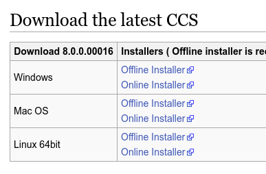
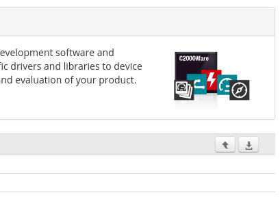
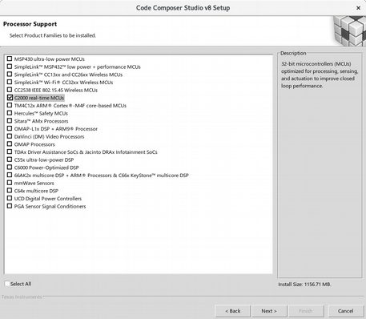
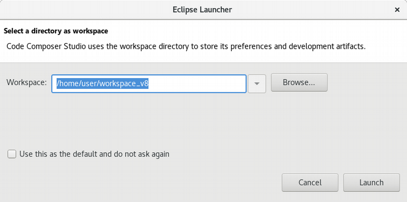
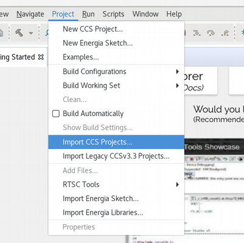
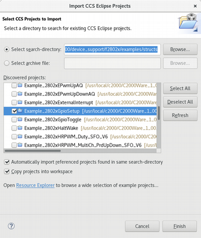

首先下载必要的软件。可以从TI官网下载，亦可以从教师提供的网盘下载。免费软件，不用激活。

1. Code Composer Studio （编译器和编辑器）
http://processors.wiki.ti.com/index.php/Download_CCS
截至本文撰写时，CCS的最新版本是8.0.0.00016

2. C2000Ware （指示寄存器地址的头文件和例程等信息）
http://dev.ti.com/tirex/#/?link=Software%2FC2000Ware
点击右侧Download All按钮

安装CCS时至少安装C2000 real-time MCUs，其它随意

C2000Ware的安装路径和CCS无关，按默认的也行

安装完成后，运行，Voilà

作为一款集成开发环境（Integrated Development Environment），CCS的基本概念之一是Workspace和Project。在使用Visual Studio学习C语言的时候，我们会命令它根据我们编写的 `*.cpp` 源代码文件生成相应的可执行的 `*.exe` 文件，这个过程叫做编译（Compile）。不完全是的。Visual Studio会将我们，也就是用户，以及系统自带的源代码文件一起编译成可执行文件。我们每次单击“构建”、“调试”或者“运行”按钮之前，Visual Studio都会检测，相比之前已经生成过的可执行文件，哪些源文件被修改过，修改时间更晚，来确定这次需要编译哪些文件，不需要重新编译哪些文件，这个过程叫做构建（Build）。在CCS平台上执行的过程是类似的。一组源文件一般会有一个文件来描述应该如何构建，这个文件就是我们通常说的工程（Project）文件。一系列相关或不相关的工程的集合叫做Workspace。CCS规定每次启动都需要指定一个Workspace。

点击菜单栏上的Project – Import CCS Project以导入例程

在Select search-directory中选择C2000安装路径下的 `C2000Ware_1_00_04_00/device_support/f2802x/examples/structs` 文件夹，并选中下方的两个复选框。按字面意思选择例程进行导入

本文档在Linux平台下撰写，因此有的细节会有略微的不同，不影响本文的正常表述。

`C2000Ware_1_00_04_00/device_support/f2802x/examples/drivers` 下的例程比前述的新，可读性更强，是TI推荐使用的，但醉心科研的笔者暂时没用过。欢迎大家尝试使用，有问题我们可以一起讨论

`C2000Ware_1_00_04_00/device_support/f2802x/docs/F2802x_DEV_USER_GUIDE.pdf` 是例程的说明文档，同文件夹下的另一个PDF文件是新例程的参考文档。说明文档说得很详细，文中有每一个例程的的讲解

说明文档2.4.1节和我前文的描述有所出入。之所以我推荐勾选“Copy projects into
workspace”，是因为这样可以确保在只修改工程内的工程文件和含有 `main` 函数的C文件时，C2000Ware安装文件夹下的文件保持不变。PDF中推荐取消勾选该选项，是因为后文还需要修改头文件，这使得安装文件夹下的文件必然会被修改。学过C语言的我们都知道，对头文件的修改一般也可以通过修改C文件以实现。

除了前述的两个文档外，推荐大家查阅的文档还有

1. http://www.ti.com/product/TMS320F28027/technicaldocuments 重点看下面的User guides部分，其中System Control and Interrupts Reference Guide是GPIO和板上一种定时器的参考文档，Enhanced Pulse Width Modulator (ePWM) Module UG是板上另一种定时器暨数模转换器的参考文档，Serial Communications Interface (SCI) RG是串口通信的参考文档，Analog-to-Digital Converter and Comparator Ref. Guide是模数转换器的参考文档。最上方的Datasheet里面是芯片的电气特性等信息。阅读9分正向你招手
2. http://processors.wiki.ti.com/index.php/Using_the_serial_adapter_of_XDS100 如何配置开发板上的串口与电脑通信。电脑端软件可使用任意一款串口调试助手
3. http://en.cppreference.com/w/c C语言参考文档
4. http://dev.ti.com/tirex 随便看看吧，一堆奇奇怪怪的文档放在一起

说一下第一次实验发现的一些问题：

1. 提示找不到 `*.out` 文件

   这个问题是因为导入工程的时候没有复制到当前Workspace，而工程构建的时候会将生成的 `*.out` 文件放在工程文件夹下。现在工程文件夹在安装目录下面，在没有管理员权限的时候有的同学的安装目录是没有办法写入的，自然找不到 `*.out` 文件

2. 有个 `*.asm` （汇编语言）文件每一行都报错

   仔细看看，文件内容是C文件的语法。应该是C2000Ware安装目录下的这个 `*.asm` 文件被意外修改或者覆盖掉了。被覆盖掉的可能原因同上

3. “Visual C++ Runtime Error”

   可能是Windows系统的某些库出了问题，或者CCS没有安装好

4. 本文的安装步骤和之前看到的不一样，需要重新安装吗？

   如果是因为前文所述C2000Ware被修改导致的问题，可以重装一遍C2000Ware，或者复制一份健康的 `device_support` 文件夹。正常的话一般不需要重新安装

5. 我在例程的基础上修改了程序，现在想重新导入一下，导入不了了，怎么办？

   把现有的工程重命名一下。同理，我们知道我们现在接触到的CCS工程中最有价值的只有那个带 `main` 函数的C文件（大家可以右键点击Properties看到只有它不在C2000Ware的安装目录下），因此我们可以移花接木把另一个工程的这个文件替换掉原来的，一样可以编译运行（这不是最优雅的办法，但是这是我习惯的套路，有更好的我们可以一起讨论）

6. 在什么地方提问呢？

   https://github.com/gzxu/microprocessors-2018spring-talk/issues

